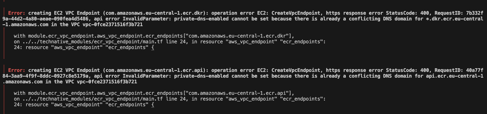

# Terraform AWS ECR-VPC-endpoint 

<!-- SHIELDS -->

This module creates an Amazon Elastic Container Registry (ECR) endpoint in a specified Amazon Virtual Private Cloud (VPC).

The VPC ECR Endpoint module allows you to create an endpoint for your ECR repository within a VPC. This enables your resources within the VPC to securely access the ECR repository without traversing the public internet.

The module takes in the necessary parameters such as VPC ID, subnet IDs, and security group IDs to create the ECR endpoint. It also supports customizing the endpoint policy and enabling private DNS resolution.

[](https://www.technative.nl)

## How does it work

### First use after you clone this repository or when .pre-commit-config.yaml is updated

Run `pre-commit install` to install any guardrails implemented using pre-commit.

See [pre-commit installation](https://pre-commit.com/#install) on how to install pre-commit.

## Usage
Example usage:

```terraform
module "vpc_ecr_endpoint" {
   source = "path/to/module"

   vpc_id              = "vpc-12345678"
   subnet_ids          = ["subnet-12345678", "subnet-87654321"]
   security_group_ids  = ["sg-12345678"]

   endpoint_policy     = <<EOF
      {
         "Statement": [
            {
               "Sid": "AllowECRAccess",
               "Principal": "*",
               "Action": [
                  "ecr:GetAuthorizationToken",
                  "ecr:BatchCheckLayerAvailability",
                  "ecr:GetDownloadUrlForLayer",
                  "ecr:GetRepositoryPolicy",
                  "ecr:DescribeRepositories",
                  "ecr:ListImages",
                  "ecr:DescribeImages",
                  "ecr:BatchGetImage"
               ],
               "Effect": "Allow",
               "Resource": "*"
            }
         ]
      }
   EOF

   enable_private_dns_resolution = true
}
```
## Known Errors
If you receive this error just re-apply as it takes somewhat longer to delete the referenced endpoint url



<!-- BEGIN_TF_DOCS -->
## Providers

| Name | Version |
|------|---------|
| <a name="provider_aws"></a> [aws](#provider\_aws) | >=4.21.0 |

## Modules

No modules.

## Resources

| Name | Type |
|------|------|
| [aws_security_group.interface_endpoint_sg](https://registry.terraform.io/providers/hashicorp/aws/latest/docs/resources/security_group) | resource |
| [aws_vpc_endpoint.ecr_endpoints](https://registry.terraform.io/providers/hashicorp/aws/latest/docs/resources/vpc_endpoint) | resource |
| [aws_vpc_endpoint.s3](https://registry.terraform.io/providers/hashicorp/aws/latest/docs/resources/vpc_endpoint) | resource |
| [aws_vpc_security_group_egress_rule.allow_wan_ipv4_interface_endpoint](https://registry.terraform.io/providers/hashicorp/aws/latest/docs/resources/vpc_security_group_egress_rule) | resource |
| [aws_vpc_security_group_ingress_rule.allow_traffic](https://registry.terraform.io/providers/hashicorp/aws/latest/docs/resources/vpc_security_group_ingress_rule) | resource |
| [aws_caller_identity.current](https://registry.terraform.io/providers/hashicorp/aws/latest/docs/data-sources/caller_identity) | data source |
| [aws_iam_policy_document.allow_account_access_ecr_endpoints](https://registry.terraform.io/providers/hashicorp/aws/latest/docs/data-sources/iam_policy_document) | data source |
| [aws_iam_policy_document.s3_vpc_endpoint_policy](https://registry.terraform.io/providers/hashicorp/aws/latest/docs/data-sources/iam_policy_document) | data source |
| [aws_region.current](https://registry.terraform.io/providers/hashicorp/aws/latest/docs/data-sources/region) | data source |

## Inputs

| Name | Description | Type | Default | Required |
|------|-------------|------|---------|:--------:|
| <a name="input_ecr_vpc_endpoint_access_sg_ids"></a> [ecr\_vpc\_endpoint\_access\_sg\_ids](#input\_ecr\_vpc\_endpoint\_access\_sg\_ids) | The ID of the security group to allow access to the ECR VPC endpoint. | `list(string)` | n/a | yes |
| <a name="input_private_subnet_ids"></a> [private\_subnet\_ids](#input\_private\_subnet\_ids) | The IDs of the private subnets in which to create the VPC endpoints. | `list(string)` | n/a | yes |
| <a name="input_vpc_id"></a> [vpc\_id](#input\_vpc\_id) | The ID of the VPC in which to create the VPC endpoints. | `string` | n/a | yes |

## Outputs

No outputs.
<!-- END_TF_DOCS -->
